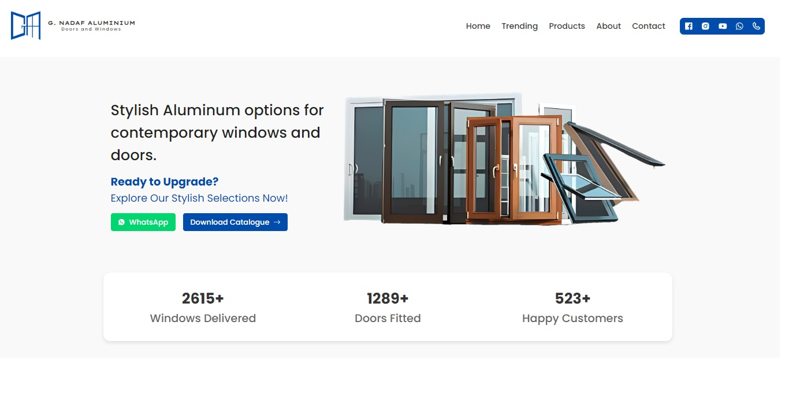
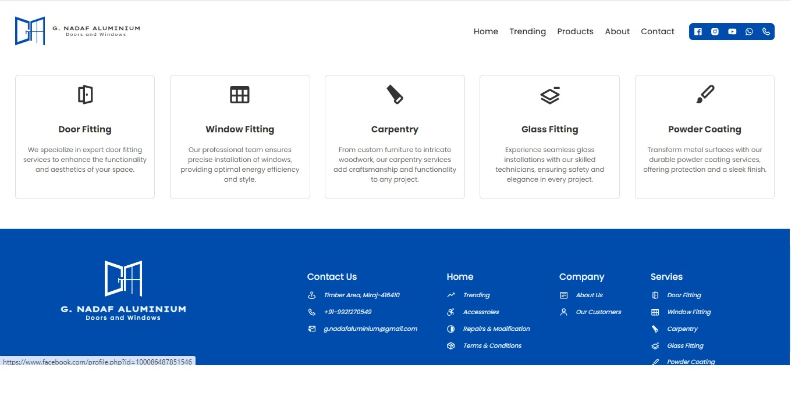
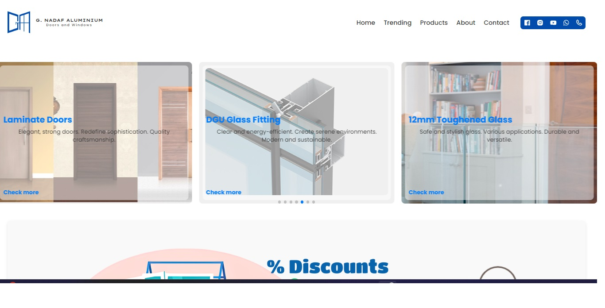
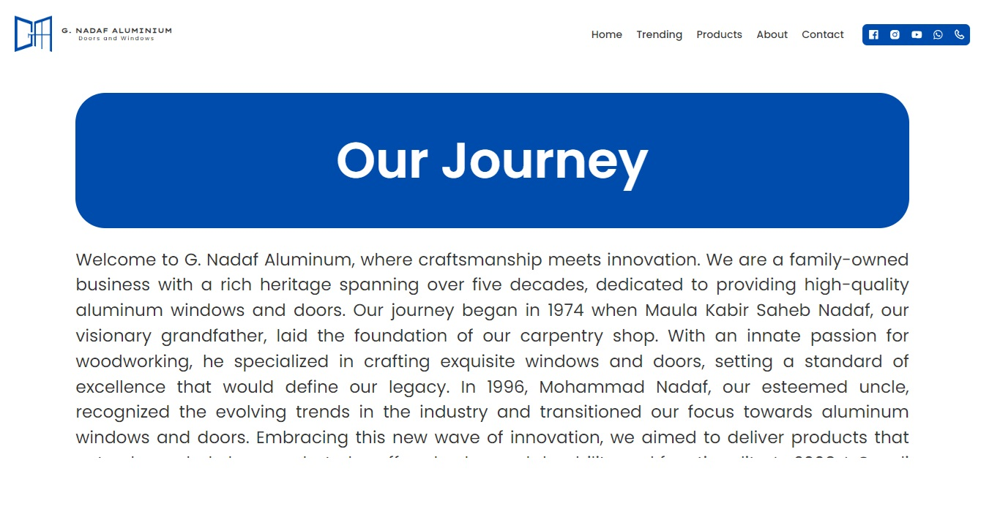
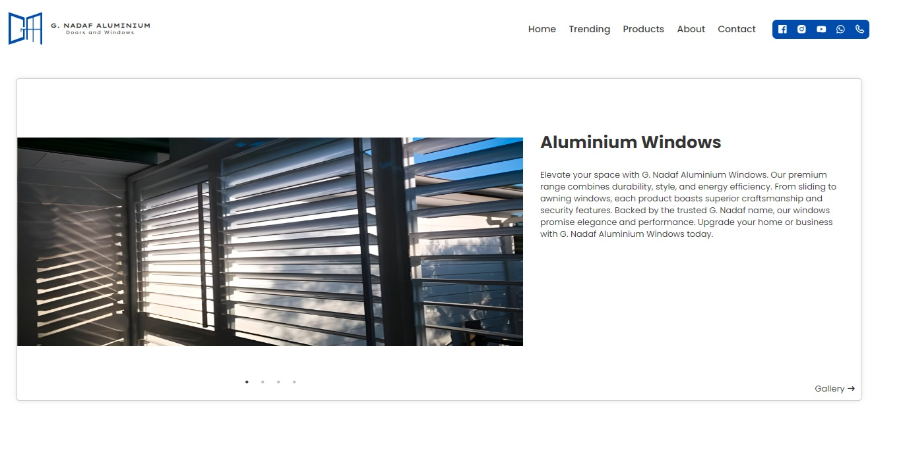
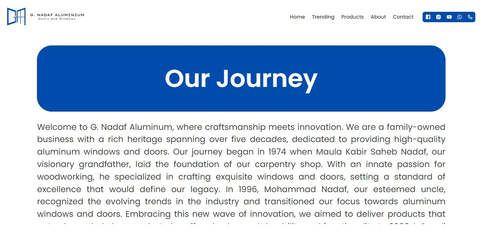
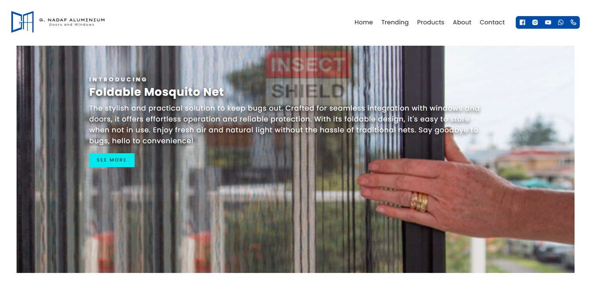

# G. Nadaf Aluminium - Business Website

This project is a React-based website for G. Nadaf Aluminium, a family-owned business specializing in high-quality aluminum windows and doors.

## Project Overview

G. Nadaf Aluminium's website showcases the company's journey, products, and services. It features a modern, responsive design with sections highlighting the company's history, product offerings, and contact information.

## Screenshots

### Hero / Home Page



The main landing page featuring various aluminum window and door options.

### About Page

This section details the company's history.
### Product Page

Showcases the company's premium range of aluminium windows.

### Contact Page

Contact page with google maps and contact details.


### Trending Page

Introduces the company's innovative products on automatic slider, will land you the gallery.


## Technologies Used

- React.js
- Yarn package manager

## Getting Started

To run this project locally:

1. Clone the repository:
   ```
   git clone https://github.com/ABDULBASIT1998/Business-website-using-React.git
   ```
2. Navigate to the project directory:
   ```
   cd Business-website-using-React
   ```
3. Install dependencies:
   ```
   yarn install
   ```
4. Start the development server:
   ```
   yarn start
   ```


